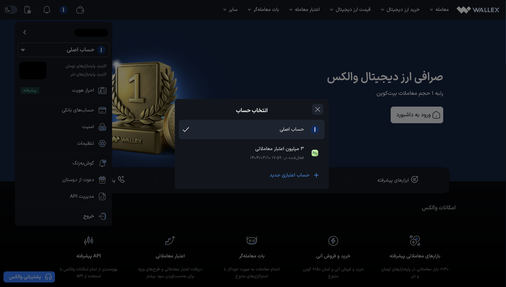
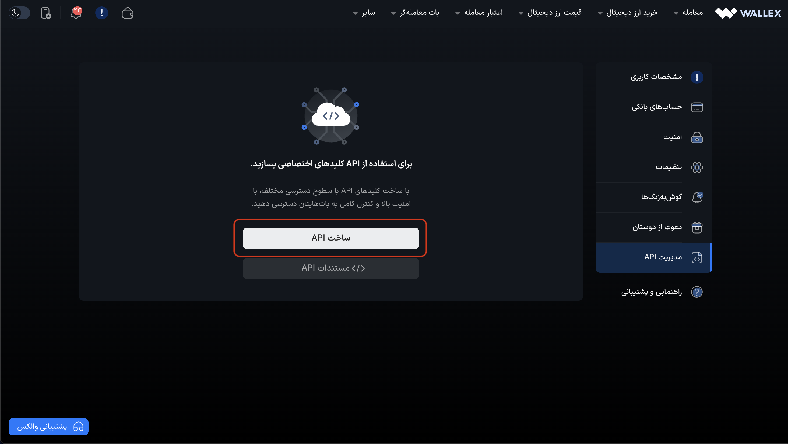
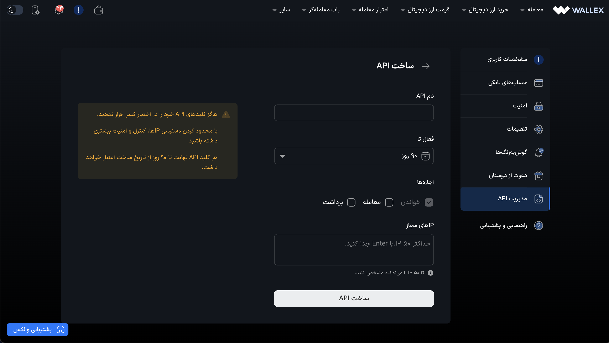
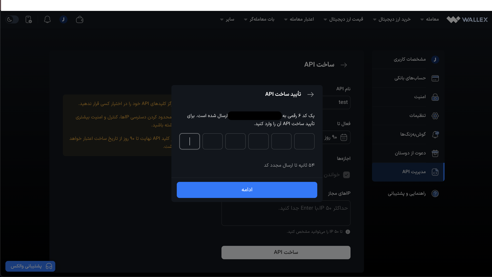
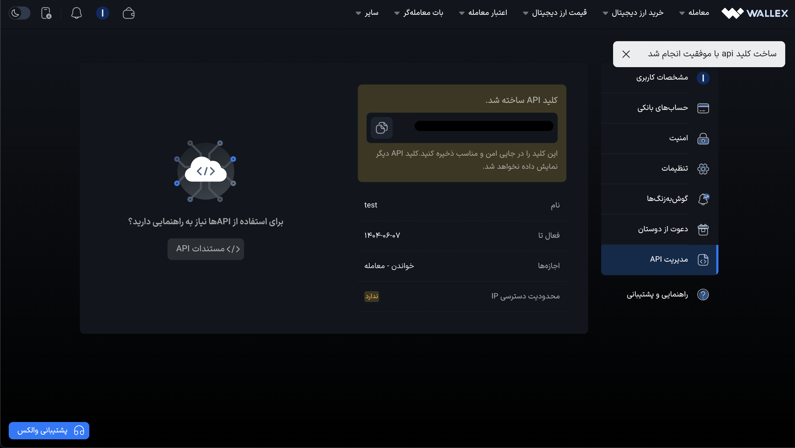

# ساخت API-Key

جهت ساخت API-Key برای فراخوانی API ، طبق راهنمای زیر اقدام کنید:

-   به [صفحه لاگین والکس](https://wallex.ir/login) مراجعه کنید و اقدام به لاگین کنید.
-   جهت ساخت API-Key ابتدا باید مشخص کنید که با چه اکانتی قصد ساخت API-Key را دارید. به منظور این کار نشانگر ماوس خود را به روی گزینه اکانت ببرید و اکانت خود را انتخاب کنید

-   توجه داشته باشید به منظور انجام معامله با اکانت اعتبار معاملاتی خود باید از API-Key مختص آن اکانت استفاده کنید و برای معامله با اکانت اصلی خود باید از API-Key اکانت اصلی خود استفاده کنید
-   به صفحه [ساخت API-Key](https://wallex.ir/app/my-account/api-management) مراجعه کنید.
-   مطابق تصویر زیر، روی گزینه ساخت API کلیک کنید.

-   سپس تمامی موارد خواسته شده در فیلدها را پر کنید:
    
-   نام API: نام اختیاری برای API-Key.
    
-   فعال تا : توجه داشته باشید که API-Key ساخته شده فقط تا مدت زمانی که انتخاب میکنید فعال میباشد.
    
-   دسترسی ها به‌صورت زیر میباشد:
    
    -   دسترسی خواندن : به‌صورت پیشفرض برای فراخوانی API این دسترسی داده شده است.
    -   دسترسی معامله : با فعال کردن این مورد میتوانید در بازارهای معاملاتی ترید انجام دهید.
    -   دسترسی برداشت : با فعال‌سازی این گزینه، امکان ثبت درخواست‌های برداشت مالی برای شما فراهم می‌شود. لطفاً توجه داشته باشید که برای استفاده از API برداشت، آدرس IP مورد استفاده باید با آدرسی که در قسمت IP وارد کرده‌اید، مطابقت داشته باشد.
-   پس از پر کردن تمامی موارد میتوانید بر روی گزینه ساخت API-Key کلیک کنید.
    

-   پس از آن باید کد دریافتی را وارد کنید تا API-Key برای شما ساخته شود.

-   بعد از تایید کد به صفحه API-Key منتقل میشوید. لطفا به یاد داشته باشید که API-Key صرفا یکبار در این صفحه نمایش داده میشود.

## نکات مهم

-   به تاریخ منقضی شدن API-Key خود توجه کنید تا استراتژی های معاملاتی شما با اختلال مواجه نشود
-   برای حفظ امنیت حساب کاربری خود، در نگهداری و محافظت از API-Key دقت لازم را داشته باشید.
-   از آنجایی که در والکس امکان دریافت اعتبار معاملاتی ، و ساخت اکانت اعتبار معاملاتی وجود دارد ، توجه داشته باشید که API-Key هر اکانت مختص به خودش هست. اکانت اصلی شما API-Key مختص خود را باید داشته باشد و همچنین هر کدام از اکانت های اعتبار معاملاتی نیز API-Key مختص خود را دارند
-   توجه داشته باشید ،حداکثر میتوانید سه عدد API-Key بسازید.